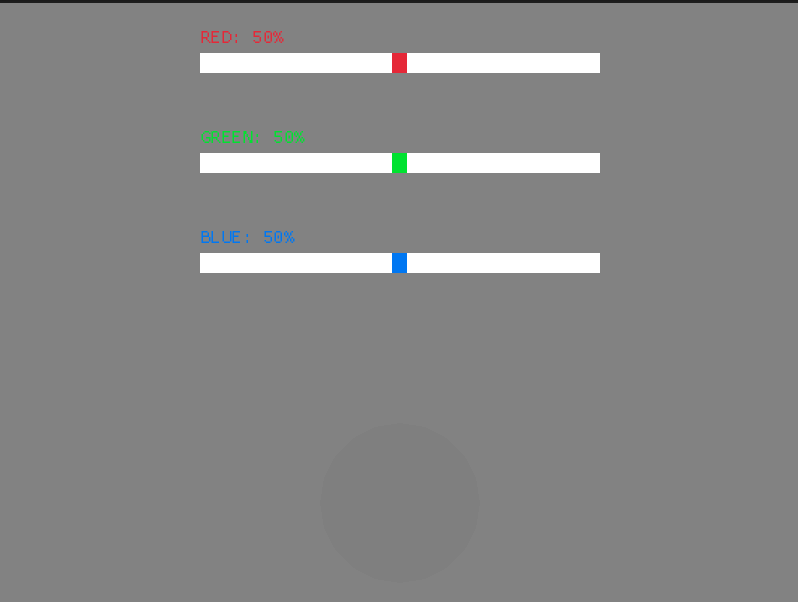

# RGB-Picker :red_circle::green_circle::blue_square:

## ¿Cual es la utilidad de este proyecto? ⁉️
Este segundo proyecto en Rust nace con la idea de simplificar a la hora de utilizar colores RGB en diferentes proyectos. Ya hay sitios web que hacen lo mismo y mejor, pero... asi practico con Rust, y de paso utilizo mi recien creada crate Slider para ello:  
  

## Uso  :gear:
Clona este repositorio:  
```
git clone https://github.com/HectorCRM/RGB-Picker.git
```

:construction: Este readme se encuentra en proceso de creacion :construction:


## Requisitos :clipboard:
 - Git
 - Linux
 - Rustc

## Mejoras futuras :rocket:
 - Habilitar botón de copia para que sea útil de verdad.  
 - Adaptar el crate Slider para que sriva con diferentes valores.  
